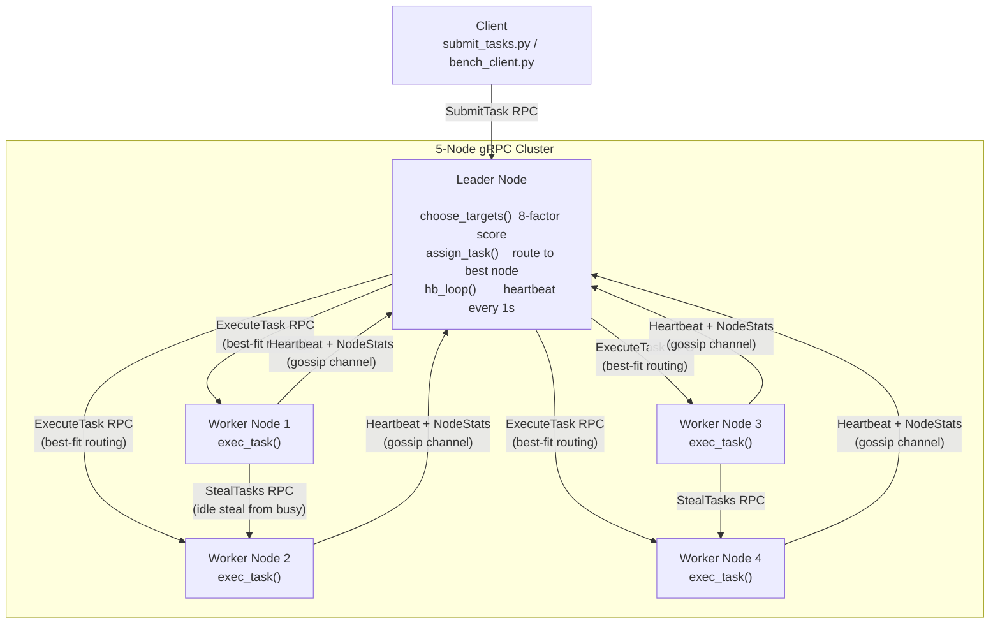

<div align="center">

# Distributed Work-Stealing Scheduler

**Fault-tolerant distributed task engine with peer-elected leader, 8-factor dynamic load balancing, and autonomous work stealing**

[](https://python.org/)
[](https://grpc.io/)
[](https://protobuf.dev/)
[](https://pypi.org/project/psutil/)
[](https://docs.python.org/3/library/concurrent.futures.html)

*Bully leader election · Heartbeat-as-gossip · 8-factor weight scoring · Work stealing · ~3s failure recovery*

</div>

---

## Impact at a Glance

- **~7× Throughput Gain** — 156  1,160 tasks/sec
- **~3 Second Recovery** — Automatic leader re-election
- **8-Factor Scheduler** — Live CPU · memory · queue · specialization
- **Autonomous Work Stealing** — Idle nodes rebalance without coordinator
- **Heartbeat-as-Gossip** — Zero extra protocol overhead
- **Decentralized Election** — Bully algorithm by weight
- **5 gRPC RPCs** — Heartbeat · Election · Submit · Execute · Steal
- **Full Experiment Suite** — Strong/weak scaling · fairness · recovery

---

## Benchmark Results

| Metric | Before | After | Gain |
|--------|--------|-------|------|
| Single-node throughput (200ms tasks) | 156 tasks/sec | **~1,160 tasks/sec** | **~7×** |
| Concurrency c=100 |  | 481 tasks/sec |  |
| Concurrency c=200 |  | 887 tasks/sec |  |
| Concurrency c=300 |  | **1,160 tasks/sec** |  |
| Leader failure recovery |  | **~3.0 seconds** |  | > **The bottleneck story:** Profiled the system and found three separate `ThreadPoolExecutor` pools (`grpc.server`, `Servicer.task_executor`, `Node.task_executor`) all capped at 32 threads, serializing dispatch to ~32 concurrent. Raising all three to 256 removed the ceiling  **~7× throughput on real 200ms tasks**. Classic "find the bottleneck, measure the fix" distributed systems debugging.

---

## Architecture



---

## How It Works

### 1. Leader Election (Bully Algorithm)

```
Node 0 bootstraps as leader on startup
  Followers: monitor heartbeat every 1s, timeout = 3s
  On timeout  start_election()
    Send Election RPC to all peers with own weight
    If any higher-weight peer replies ok=True  back off, that peer runs election
    If no higher-weight peer  become_leader()  broadcast heartbeats
  Tie-break: same weight  lower node ID wins
```

### 2. Heartbeat as Gossip Channel

Every heartbeat carries full `NodeStats`  zero extra protocol overhead:

```protobuf
message NodeStats {
  int32  queue_length;
  float  cpu_usage;
  float  memory_available;
  float  avg_response_time;
  int32  tasks_completed;
  int32  tasks_failed;
  map<string, float> specialization;  // task_type  success_rate
}
```

This keeps every node's `peer_stats` map current  feeding all scheduling and stealing decisions at 1s granularity.

### 3. 8-Factor Dynamic Load Balancing

With `--advanced-weight`, each node gets a composite score:

```
score(node) = weight × queue_penalty × specialization_bonus × distance_penalty
```

Where `weight = calculate_advanced_weight()`:

| Factor | Weight | What It Measures |
|--------|--------|-----------------|
| Capacity | **20%** | CPU + memory + bandwidth headroom |
| Reliability | **20%** | Task success rate |
| History | **15%** | Total tasks completed |
|  Response time | **15%** | Average task execution time |
| Queue length | **10%** | Current backlog depth |
| Network distance | **10%** | Estimated hop cost |
|  Time decay | **5%** | Recency of activity |
| Specialization | **5%** | Task-type affinity score | ### 4. Work Stealing

```
Idle node (queue < threshold):
   StealTasks RPC to busiest peer (from peer_stats)
   Victim yields 10 tasks, keeps minimum reserve
   0.5s cooldown between steal attempts (prevents thrashing)
   Stealer weight , victim weight   self-regulating
```

### 5. Failure Recovery (~3 seconds)

```
Leader killed
   followers miss heartbeat for 3s
   monitor_loop triggers start_election()
   highest-weight survivor wins election
   new leader begins broadcasting heartbeats
   cluster resumes accepting task submissions
  Total measured: ~3.0 seconds end-to-end
```

---

## gRPC Services

```protobuf
service DwseNode {
  rpc Heartbeat   (HeartbeatRequest)  returns (HeartbeatResponse);  // gossip channel
  rpc Election    (ElectionRequest)   returns (ElectionResponse);   // bully election
  rpc SubmitTask  (TaskRequest)       returns (TaskResult);         // client entry point
  rpc ExecuteTask (TaskAssignment)    returns (TaskResult);         // leader  worker
  rpc StealTasks  (StealRequest)      returns (StolenTasks);        // idle  busy
}
```

---

## Run It

### Setup

```bash
python3 -m venv .venv && source .venv/bin/activate
pip install grpcio grpcio-tools psutil
./scripts/build_proto.sh
```

### Start 5-node cluster (one command)

```bash
./start_nodes.sh
# Starts nodes 04 on ports 5005050054
# Logs: node0.log  node4.log
```

### Submit tasks

```bash
python submit_tasks.py --leader-port 50050 --num-tasks 500 --payload 200
```

### Run high-concurrency benchmark

```bash
python bench_client.py \
  --leader-port 50050 \
  --num-tasks 4000 \
  --payload 200 \
  --concurrency 300
```

### Full experiment suite

```bash
./run_failure_recovery_test.sh   # kill leader  time re-election
./run_fairness_test.sh           # imbalance  measure rebalance
./run_strong_scaling_test.sh     # fixed tasks, vary node count
./run_weak_scaling_test.sh       # fixed tasks/node, scale nodes
```

### Stop cluster

```bash
./stop_nodes.sh
```

---

## Tech Stack

| Layer | Technology |
|-------|-----------|
|  | Python 3  asyncio-friendly, ThreadPoolExecutor |
|  | gRPC  bidirectional, low-latency RPC |
|  | Protocol Buffers v3 |
|  | Live CPU, memory, network stats |
|  | Three 256-worker pools (server + servicer + node) |
|  | Benchmark analysis and visualization | ---

## Design Decisions & Trade-offs

| Decision | Why | Known Limitation |
|----------|-----|-----------------|
| Bully election by weight | Simple, no shared log or quorum needed | Not partition-safe; weight is node-local |
| Heartbeat as gossip channel | Zero extra protocol overhead | Stats are 1s stale; leader is stats bottleneck |
| Work stealing with 0.5s cooldown | Prevents thrashing under burst load | Cooldown may delay rebalancing at extreme load |
| ThreadPoolExecutor 256 | Removes 32-thread dispatch ceiling (~7× gain) | Memory cost of 256 idle threads per pool |
| Single leader dispatch | Simple routing, easy to reason about | Leader is single point of throughput scaling | ---

<div align="center">

**Built with Python · gRPC · Protocol Buffers · psutil**

*Distributed Systems · Load Balancing · Fault Tolerance · Work Stealing · Leader Election*

</div>
